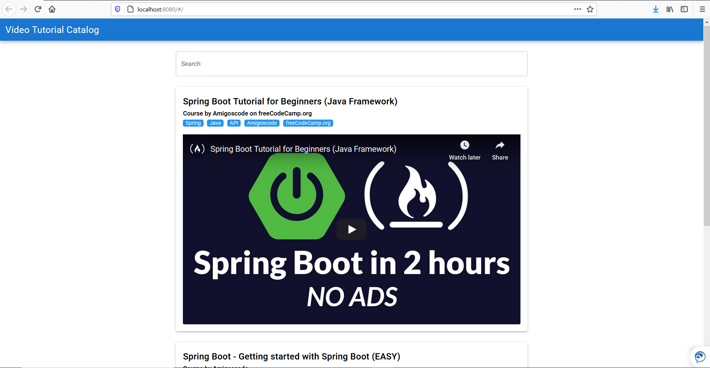

# Tutorial Catalog
This project aims to list tutorial videos that are shorter than 2 hours. 

The idea is simple. 

We have limited time and there are a lot of things to learn. Therefore, this catalog aims to provide quality arguably short tutorials that will give you the main ideas of the topic. Then, you can go deeper if you wish.

# Contributions
You can contribute both developing website and suggesting new tutorials.

# Spread the knowledge
Share freely this website on anywhere :)

# How to select tutorial videos?
Tutorials are hand-curated to meet certain quality.

## Criterias of quality tutorial videos:
- Should be shorter than 2 hours.
- Should cover the main ideas of the topic.
- Should mention possible use cases of the topic.

# To Do
- Create project board
- Create vue app
- Find tutorial videos
- Rate tutorials in terms of covarage, etc.

